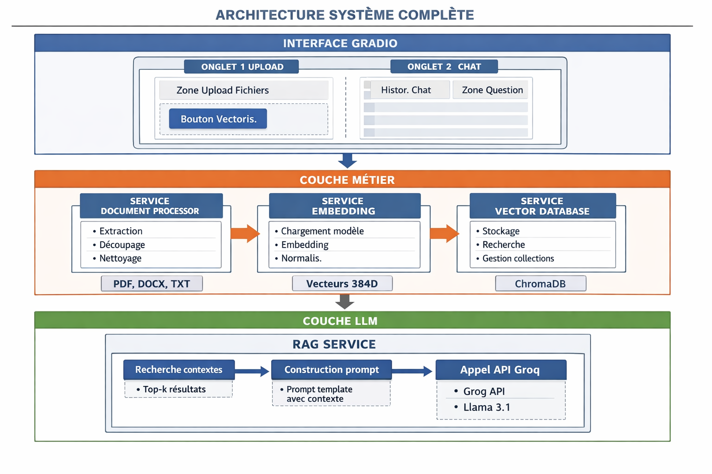
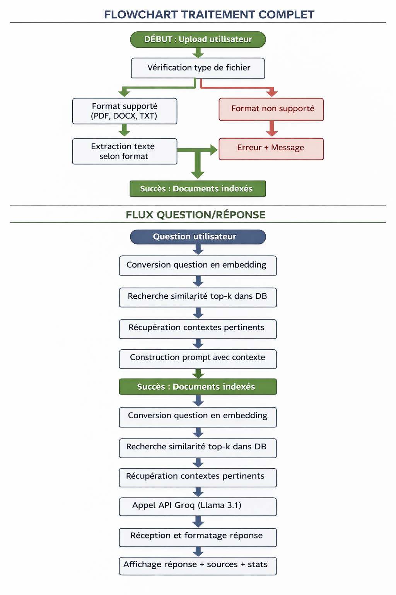
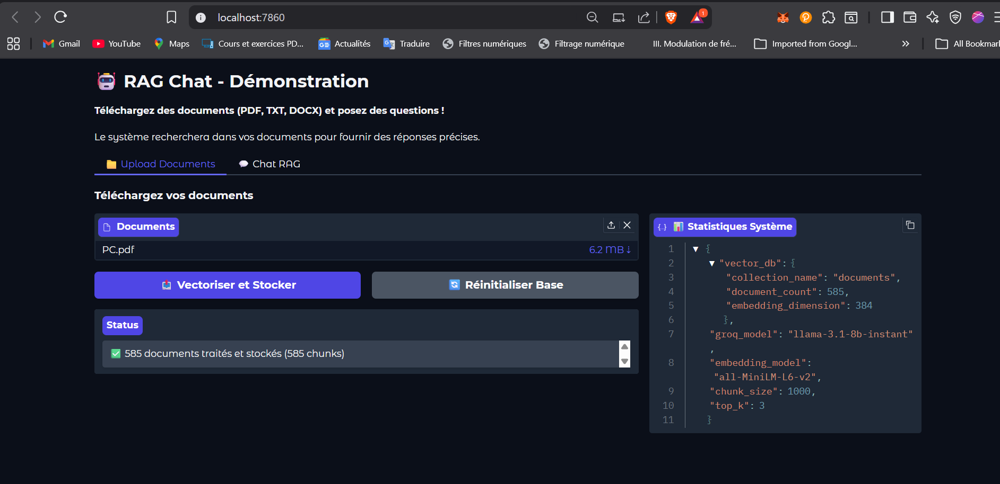
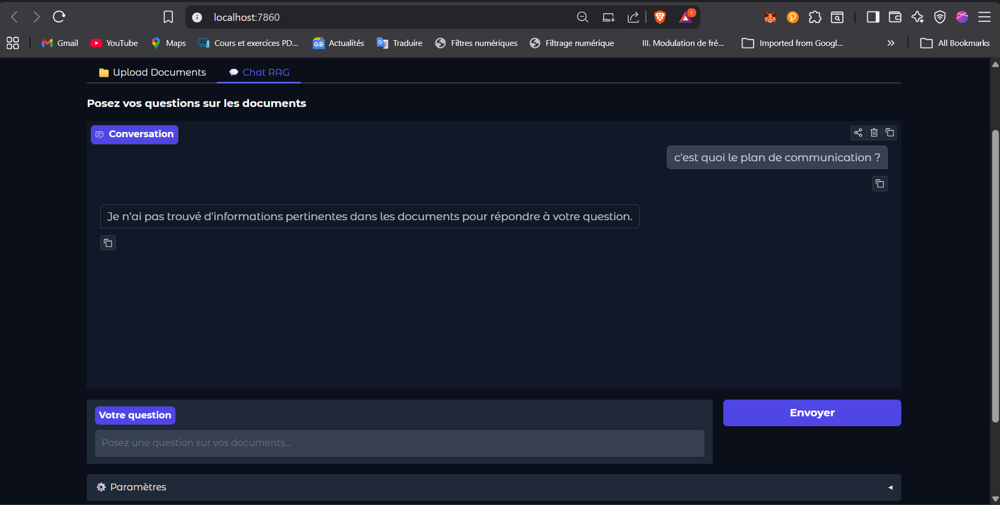
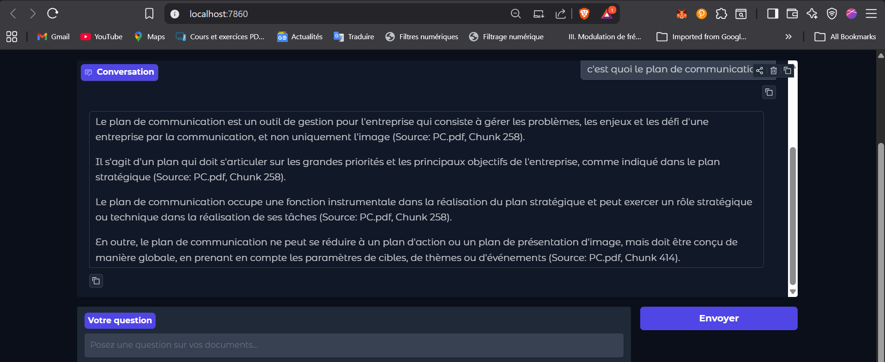
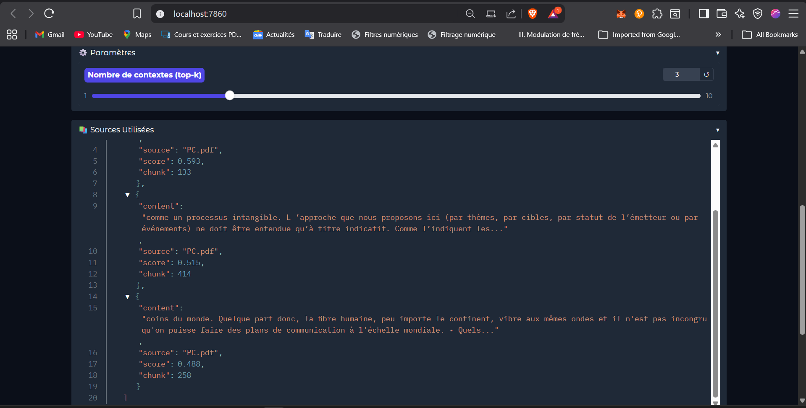
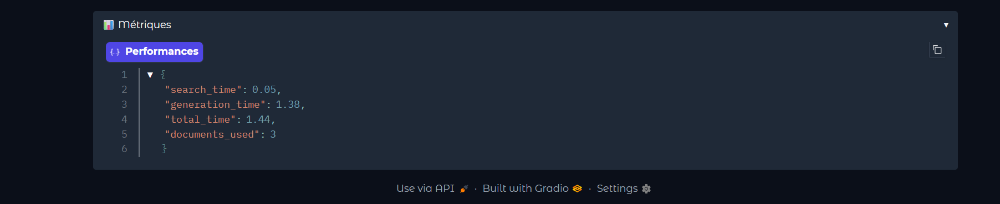

# 🤖 RAG Chat - Démonstration Python

Application de démonstration RAG (Retrieval-Augmented Generation) avec interface Gradio.

## 🚀 Installation Rapide

```bash
# 1. Cloner
git clone <repository>
cd rag-chat-demo

# 2. Environnement virtuel
python -m venv venv
venv\Scripts\activate  # Windows
source venv/bin/activate  # Linux/Mac

# 3. Dépendances
pip install -r requirements.txt

# 4. Configuration
cp .env.example .env
# Éditez .env et ajoutez votre clé Groq API

# 5. Lancer l'application 
python main.py
```

## 🛠️🧱 Architecture

*Architecture Globale*


*Flux complet RAG*


## 🕵️💻Démonstration

*Ecran Upload de documents*


*Ecran de Chat (reponse sans contexte)*


*Ecran de Chat (reponse avec contexte)*


*Sources utilisées*


*Métriques*


## Auteur

**SAWADOGO S. Abdel K Nourou**  
Cycle Ingénieur Génie Informatique  
Faculté des Sciences et Techniques de Settat  

